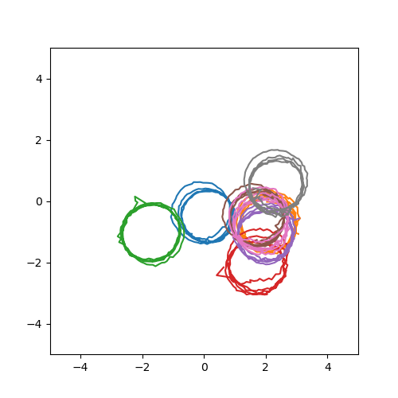
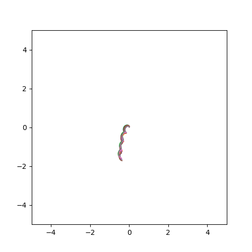

# one-step-diffusion-forcing-pytorch

If you're looking to address two persistent challenges in interactive generative models: high latency and drifting, this demo offers a compelling starting point.

Built upon recent advances such as [Diffusion Forcing](https://arxiv.org/abs/2407.01392), [Shortcut Model](https://arxiv.org/abs/2410.12557) and [Mean Flow](https://arxiv.org/abs/2505.13447), this repository combines these techniques into a unified, end-to-end training framework for a stable 1-NFE (Number of Function Evaluations) autoregressive diffusion model.

At each inference timestep, the model takes in:
- Random noise
- The previous hidden state
- The previously generated sample

It then outputs:
- The updated hidden state
- The generated sample for the current timestep

The inference code looks like this (with 1 NFE):

```python
past_h = torch.zeros(2, num_eval, dim)
past_x = torch.zeros(num_eval, 1, 2)
x_seq = []
for i in range(T): # note that this is not the denoising loop
    noise = torch.randn(num_eval, 1, 2)
    x, h = model(noise, h=past_h, past_x=past_x)
    x_seq.append(x)
    past_x, pash_h = x, h
```

The loss function looks like this (more details are in loss.py):
```python
t0, t1, t2, tm = sample_t(x)   # t1 < t2, tm = (t1 + t2) / 2
e = randn_like(x)
z0, z1, z2 = lerp(e, x, t0), lerp(e, x, t1), lerp(e, x, t2)

# Here we use z2 as the surrogate of generated samples,
# following the basic concept of Diffusion Forcing.
v_t0 = v(z0, t0, t0, past_x=z2)
v_t1t2 = v(z1, t1, t2, past_x=z2)
v_t1tm = v(z1, t1, tm, past_x=z2)
v_tmt2 = v(z1 + v_t1tm * (tm - t1), tm, t2, past_x=z2)

loss1 = mse(v_t0, x - e) # ReFlow loss
loss2 = mse(v_t1t2 * 2, stop_grad(v_t1tm + v_tmt2))   # shortcut loss

loss = loss1 + loss2
```

## Evaluation result on toy dataset

Each training sample is a trajectory with a length of 64, and roughly forms a circular arc.
The test samples are generated in an autoregressive manner and is extrapolated to 256 timesteps. With 1-NFE per timestep, the model can keep the property of the circular arc (center, diameter, tec.) in the extrapolated timesteps.

results with our method



results with predictive loss (the model can't learn anything)



## Run the demo
1. Create a Python environment (version 3.10 is suggested)
2. Install requirements with pip
3. Run the demo
```shell
python main.py
```

## TODO

Currently, we use GRU/LSTM as the sequence model, we will later try to use modern RNN architectures (Mamba, TTT, etc.). (Transformers for temporal processing is not considered as an option here, because we want to have infinite memory in a contrained memory space)

## Code references
https://github.com/zhongshuren/one-step-diffusion-pytorch

https://github.com/buoyancy99/diffusion-forcing

https://github.com/yukara-ikemiya/modified-shortcut-models-pytorch

https://github.com/haidog-yaqub/MeanFlow
